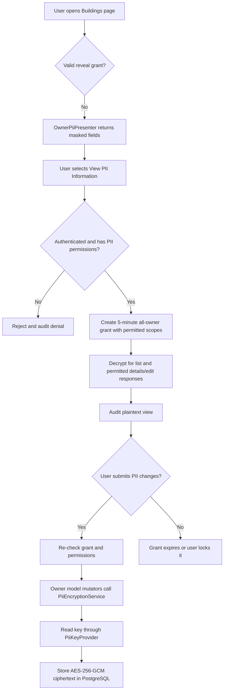

# Owner PII Encryption — System Impact Analysis

**Module:** Building Information  
**Table:** `building_info.owners`  
**Protected fields:** `owner_name`, `owner_contact`, `owner_gender`, `nid`  
**Current implementation:** Local development baseline  
**Purpose:** Explain how the previous system changed, where the external key is used, which code paths are affected, and what remains before production.

## 1. Executive summary

Previously, owner PII was stored and used as ordinary plaintext. Any application code or database user with access to `building_info.owners` could read the owner name, contact, gender, and NID directly. The edit form loaded those values automatically, owner-name search used the database value, and exports could include owner data without a separate reveal boundary.

The current implementation adds **application-level envelope-ready encryption with temporary, role-based reveal**:

- New and updated PII is encrypted before Eloquent sends it to PostgreSQL.
- AES-256-GCM provides confidentiality and detects modified ciphertext.
- Normal building screens receive masked values by default.
- A permitted, authenticated user must explicitly choose **Reveal Owner PII**.
- The reveal grant lasts five minutes and is restricted either to one building's `view`/`edit` scope or to an all-owner grant covering the list and details; edit scope is included only when the user already has building-edit permission.
- Viewing, unlocking, editing, denial, and locking events are recorded without logging the PII value.
- The server encryption key is read from a file outside the repository. It is never entered by an end user and is never sent to the browser.

This is a safer baseline than the previous system, but it is not yet the final production security design. Production should replace the local file key provider with KMS/Vault/HSM-backed key retrieval and should add strong re-authentication or MFA before reveal.

## 2. Before-and-after impact

| Area | Previous system | Current system | Impact |
|---|---|---|---|
| Database storage | Four PII fields stored as readable values | Values stored as versioned ciphertext such as `enc:v1:...` | Direct SQL no longer shows usable PII after backfill |
| Column types | Length-limited character fields | All four fields changed to PostgreSQL `TEXT` | Accommodates longer authenticated ciphertext |
| Application writes | Controller/service assigned plaintext directly | `Owner` model mutators encrypt every assignment | Central protection for normal Eloquent writes |
| Application reads | Views/controllers could receive plaintext automatically | `OwnerPiiPresenter` returns masked values unless a valid reveal grant exists | Plaintext exposure is deliberate and narrow |
| Building DataTable | Owner name was displayed as ordinary data | Only owner name is included as PII and uses the fixed mask `********`; an authorized bulk reveal shows plaintext across DataTable pages and building screens for five minutes | Broad access is explicit, expiring, no-cache, permission-checked, and audited |
| Editing | PII fields were immediately editable | Fields remain masked/disabled until explicitly revealed | Prevents accidental or unauthorized changes |
| Authorization | General building permissions governed access | `View Owner PII` and `Unlock Owner PII` are checked on every reveal/use | More granular least-privilege control |
| Temporary access | No special access state | Server-side session grant: user + building + scope + five-minute expiry | A grant cannot reveal every building or last indefinitely |
| Search | Owner-name filtering depended on plaintext/`ILIKE` | Hidden and ignored while locked; temporarily available in reveal mode through an authorized server-side decrypt-and-match scan | AES-GCM ciphertext is not directly searchable; a blind search index should replace the scan at larger scale |
| Export | Owner data could flow through ordinary export code | Owner fields/search are removed from normal export paths | A dedicated, authorized PII export should be built later |
| Browser caching | Sensitive pages used normal cache behavior | `pii.no-cache` adds private/no-store headers | Reduces plaintext retention in browser/intermediate caches |
| Audit | No dedicated owner-PII security trail | Append-only application model records security events | Supports investigation and compliance review |
| URLs/resources | Several building actions used `bin` | Affected routes use model binding by `public_id` | Avoids exposing/depending on the business identifier in these routes |

## 3. Current request and data flow

### Where the external key is used

The local key file is `E:\app-secrets\lang-web-app\pii.key`. The `.env` configuration points to its location through `PII_KEY_FILE` or `PII_KEY_V1_FILE`; the key value itself must not be copied into `.env`, source code, Git, logs, tickets, or screenshots.

The runtime path is:

1. `config/pii.php` selects the provider, active key version, key-file path, cipher, prefix, migration fallback, audit flag, and reveal duration.
2. `PiiServiceProvider::register()` binds `PiiKeyProvider` to `FilePiiKeyProvider` for local use.
3. `FilePiiKeyProvider::key()` reads the Base64 text, decodes it, and requires exactly 32 bytes.
4. `PiiEncryptionService::encrypt()` requests the active version's key and produces randomized authenticated ciphertext.
5. `PiiEncryptionService::decrypt()` reads the version from `enc:<version>:` and requests the matching key.

The key encrypts/decrypts data **only on the application server**. The reveal button does not expose or accept this key. Losing the key makes its ciphertext unrecoverable; leaking it compromises every owner value encrypted with that version. Backups and production secret-management controls are therefore mandatory.

## 4. Files and functions changed or added

### Encryption and key management

- `config/pii.php` — central PII settings and version-to-key-file mapping.
- `.env.example` — documents the required PII environment variables without containing secrets.
- `app/Contracts/PiiKeyProvider.php` — key-source contract.
- `app/Services/PiiKeys/FilePiiKeyProvider.php` — `key()` loads and validates the local key.
- `app/Providers/PiiServiceProvider.php` — `register()` binds the configured key provider.
- `config/app.php` — registers `PiiServiceProvider`.
- `app/Services/PiiEncryptionService.php` — `encrypt()`, `decrypt()`, `isEncrypted()`, and `version()` implement versioned AES-256-GCM handling, null preservation, randomized output, and double-encryption protection.
- `app/Models/BuildingInfo/Owner.php` — `setOwnerNameAttribute()`, `setOwnerGenderAttribute()`, `setOwnerContactAttribute()`, `setNidAttribute()`, and `setEncryptedPiiAttribute()` encrypt PII on model assignment.

### Presentation, access, and audit

- `app/Services/OwnerPiiPresenter.php` — `presentMasked()` masks ordinary output; `presentPlaintext()` explicitly decrypts authorized output; `maskName()`, `maskContact()`, `maskNid()`, and `maskGender()` define masking rules.
- `app/Services/PiiAccessService.php` — `unlock()`, `lock()`, `canUnlock()`, `isUnlocked()`, `secondsRemaining()`, and `authenticationMethod()` manage resource- and scope-bound session grants.
- `app/Http/Controllers/BuildingInfo/OwnerPiiAccessController.php` — `unlockList()`, `lock()`, and `authorizePiiListUnlock()` enforce the list-originated reveal boundary and record events.
- `app/Services/OwnerPiiAuditService.php` — `record()` writes security events; `safeContext()` rejects sensitive context keys.
- `app/Models/OwnerPiiAuditLog.php` — maps the append-only audit record.
- `app/Http/Middleware/PreventPiiResponseCaching.php` — `handle()` adds no-store response headers.
- `app/Http/Kernel.php` — registers middleware alias `pii.no-cache`.

### Building module integration

- `app/Http/Controllers/BuildingInfo/BuildingController.php`:
  - `__construct()` injects the PII services and protects `show`/`edit` from caching.
  - `show()` and `edit()` choose masked versus plaintext presentation and audit plaintext access.
  - `update()` blocks PII updates without a valid edit grant.
  - `containsOwnerPiiUpdate()`, `canUnlockOwnerPii()`, and `ownerPiiIsUnlocked()` centralize checks.
  - `index()`, `getData()`, and `ownerPiiListIsUnlocked()` enforce the all-owner grant and audit bulk views; normal detail/edit route permissions still apply.
- `app/Services/BuildingInfo/BuildingStructureService.php` — `storeOwnerInfo()` safely writes owner fields through the encrypted model and avoids overwriting locked values; `fetchData()` masks owner names and removes affected owner search behavior; `fetchExport()` removes owner-name filtering/ordinary PII exposure paths.
- `BuildingStructureService::fetchData()` uses a query-builder allowlist rather than serializing `Building` Eloquent models. This prevents automatic `Owners` relationships, ciphertext, gender, contact, NID, timestamps, and other undeclared fields from appearing in DataTable JSON.
- `app/Http/Requests/BuildingInfo/BuildingRequest.php` — permits nullable PII during a locked edit so masked/disabled fields are not treated as replacement values.
- `resources/views/building-info/buildings/partial-form.blade.php` — all four locked edit fields use the fixed mask `********`; unlocked inputs and manual lock remain available.
- `resources/views/building-info/buildings/edit.blade.php` — no standalone reveal control; users activate reveal from the Buildings list, while the edit page retains lock and automatic-expiry handling.
- `resources/views/building-info/buildings/index.blade.php` — places **View PII Information** beside exports, shows owner name with a fixed mask/plaintext reveal, provides manual lock, and automatically locks/reloads at expiry.
- `routes/web.php` — rate-limited `owner-pii/unlock-list`, manual `owner-pii/lock`, and `public_id` route-model binding for affected building/containment routes; the old single-building unlock route was removed.

### Database and operational tooling

- Existing `building_info.owners` columns `owner_name`, `owner_contact`, `owner_gender`, and `nid` were changed to `TEXT`; no extra encrypted-value columns are used.
- `database/migrations/2026_09_08_000001_create_owner_pii_audit_logs_table.php` creates `auth.owner_pii_audit_logs`.
- `database/migrations/2026_09_08_000002_drop_pii_pin_hash_from_auth_users.php` removes the abandoned application PIN column if it exists.
- `app/Console/Commands/CheckPiiConfiguration.php` — `handle()` powers `pii:check-configuration` without printing the key.
- `app/Console/Commands/EncryptExistingOwnerPii.php` — `handle()` powers chunked/dry-run legacy backfill.
- `app/Console/Commands/VerifyOwnerPiiEncryption.php` — `handle()` verifies encrypted/plaintext/invalid counts without displaying PII.
- `app/Console/Kernel.php` registers all three commands.

## 5. Compatibility, risks, and next actions

During migration, `PII_ALLOW_LEGACY_PLAINTEXT=true` allows old rows that have not yet been backfilled to remain readable by authorized application code. This is temporary compatibility—not encryption. After a database backup, dry-run, real backfill, and verification report zero plaintext/invalid values, set it to `false` so unexpected plaintext fails closed.

Before production:

1. Run the audit and cleanup migrations, configuration check, and complete PII test suite.
2. Back up the database; dry-run, execute, and verify the owner-PII backfill; then disable legacy plaintext.
3. Provision different keys for local, staging, and production. Store production keys in KMS/Vault/HSM and implement another `PiiKeyProvider`; do not deploy the developer key.
4. Back up/escrow production keys securely and document rotation/recovery. The `enc:v1:` format already supports versioned rotation.
5. Add CAS/SSO re-authentication or MFA before reveal. The present confirmation relies on the already-authenticated session; it is not fresh proof of identity.
6. Review all remaining raw SQL, reports, imports, APIs, queues, logs, backups, and exports that touch `building_info.owners`. Direct query-builder writes can bypass Eloquent mutators.
7. Build a dedicated authorized PII export service with purpose/filters, short-lived output, download auditing, and automatic deletion. Do not restore PII to the normal export.
8. Load-test backfill and key-provider failure behavior, monitor audit events, and define incident response for key loss or disclosure.

**Current validation:** Encryption-service and owner-model tests, presentation/access/audit/cache tests, syntax checks, and Blade compilation have passed locally. Database migrations and the real legacy-data backfill remain operator-controlled steps and must be verified in each environment.
