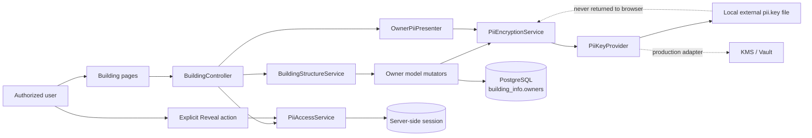
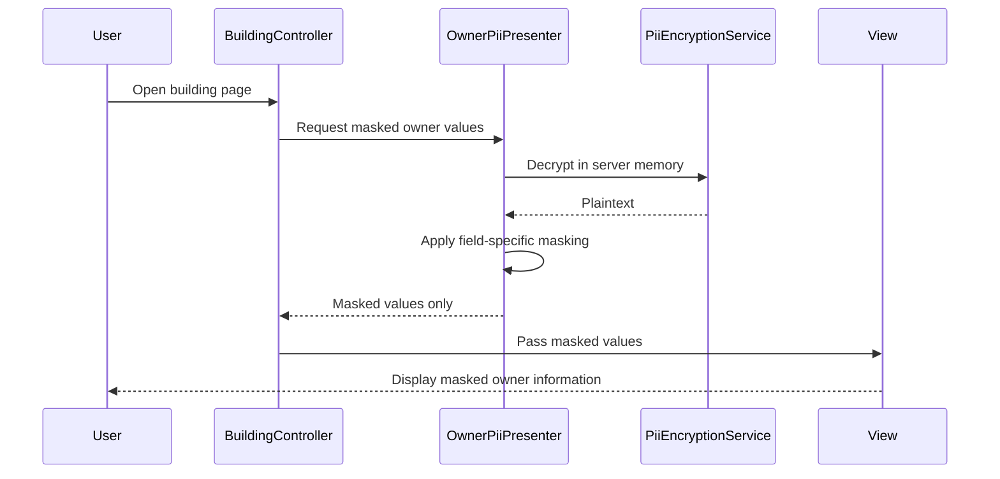
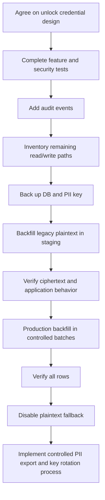

# Owner PII Encryption: Implementation Status and Process Flow

## 1. Purpose

This document explains the owner PII protection work currently implemented in the Building module. It is intended as a technical handover for leads and junior developers.

The protected fields belong to `building_info.owners`:

| Field | Meaning | Current protected display |
|---|---|---|
| `owner_name` | Owner name | First character of each word remains visible |
| `owner_contact` | Contact number | First two and last two characters remain visible |
| `owner_gender` | Gender | Fully masked as `***` |
| `nid` | National identification number | First two and last two characters remain visible |

The main goals are:

1. Encrypt sensitive values before they are stored in PostgreSQL.
2. Prevent normal pages from exposing plaintext owner information.
3. Require explicit authorization before a user can view or edit plaintext.
4. Keep the data-encryption key outside the application repository.
5. Support existing plaintext records temporarily while migration is in progress.

---

## 2. Current implementation status

The following items have been implemented:

- The four PII database columns have been changed to PostgreSQL `TEXT`, allowing them to hold encrypted payloads.
- A dedicated 256-bit PII encryption key is stored outside the project at `E:\app-secrets\lang-web-app\pii.key`.
- Laravel configuration reads the key location from `PII_KEY_FILE`.
- A dedicated encryption service encrypts and decrypts owner PII using AES-256-GCM.
- Encryption now depends on a `PiiKeyProvider` contract; the local implementation reads a file and can later be replaced with a KMS/Vault provider.
- Ciphertext versions are resolved independently (`enc:v1:`, future `enc:v2:`), allowing old and new keys to coexist during rotation.
- The `Owner` model encrypts PII automatically when one of the protected attributes is assigned.
- Encryption is randomized, so encrypting the same value twice produces different ciphertext.
- Already encrypted values are detected to prevent accidental double encryption.
- `null` values remain `null`.
- Existing plaintext values can temporarily be read during the migration period.
- Building detail and list pages display masked PII by default. The DataTable includes only owner name as PII, using the fixed mask `********`; authorized users can temporarily reveal it.
- Owner-name filtering is hidden and ignored while locked. During an authorized DataTable reveal it is restored using server-side decrypted matching; normal exports still do not accept owner-name filtering.
- The building edit page displays `********` in all four disabled PII fields while locked and has no standalone reveal button.
- The server rejects direct PII update requests unless the current user has an active unlock session.
- Authorized users can explicitly reveal PII for five minutes without creating an application-specific password or PIN.
- The privileged session is scoped to the authenticated user, allowed action, and selected building.
- Pages capable of returning plaintext send `no-store`/`no-cache` response headers.
- Reveal requests are rate-limited at the route level.
- Security audit storage and audit events have been implemented; the audit migration must be applied before using the flow.
- Safe dry-run, backfill, and verification Artisan commands have been added for legacy plaintext.
- Separate permissions exist for viewing, unlocking, and exporting PII.
- Automated unit tests cover encryption, masking, model mutators, and temporary unlock behavior.

### Important current-state note

Users do not create or enter a PII password/PIN, and they never enter the master encryption key. The current local flow relies on the authenticated application session plus explicit `View Owner PII` and `Unlock Owner PII` permissions, together with the relevant building-list or building-edit permission. A reveal is intentional, lasts five minutes, is rate-limited and audited, and is limited either to one building or to the all-owner list/details scope. Edit scope is added only for users who already have building-edit permission.

For production, the same reveal endpoint should be strengthened with fresh CAS/SSO authentication or MFA when the identity provider supports it.

---

## 3. High-level architecture



### Responsibility of each layer

| Layer | Responsibility |
|---|---|
| Browser/UI | Shows masked data and an explicit audited reveal confirmation to authorized users |
| `BuildingController` | Checks permissions and active unlock state before presenting or updating PII |
| `PiiAccessService` | Stores the user-, scope-, and building-specific unlock state and expiry in the server session |
| `OwnerPiiPresenter` | Produces either masked values or explicitly decrypted plaintext values |
| `Owner` model | Encrypts protected fields whenever they are assigned before persistence |
| `PiiEncryptionService` | Performs version-aware authenticated encryption/decryption through a key-provider contract |
| PostgreSQL | Stores ciphertext, not the external encryption key |

---

## 4. Encryption design

### Algorithm

The implementation uses **AES-256-GCM** through Laravel's `Illuminate\Encryption\Encrypter`.

AES-256-GCM provides:

- Confidentiality: the database value does not reveal the original PII.
- Integrity and authenticity: modified ciphertext fails authentication instead of returning silently corrupted data.
- Randomized encryption: the same plaintext produces different ciphertext each time.

Encrypted values use a version prefix:

```text
enc:v1:<encoded encrypted payload>
```

The prefix allows the application to:

- Recognize encrypted values.
- Avoid double encryption.
- Distinguish temporary legacy plaintext records.
- Introduce a future `enc:v2:` format during key rotation or algorithm changes.

### Key handling

The encryption key is generated as 32 random bytes and Base64-encoded. It is stored outside the Git repository:

```text
E:\app-secrets\lang-web-app\pii.key
```

The application receives only the file path through configuration:

```dotenv
PII_KEY_FILE=E:/app-secrets/lang-web-app/pii.key
```

The key must never be:

- Committed to Git.
- Written to application logs.
- Included in screenshots or tickets.
- Stored in JavaScript or browser local storage.
- Sent in exports.
- Shared as a normal user credential.

Losing this key means encrypted owner data cannot be recovered. Anyone who obtains it and the database can decrypt all protected owner records.

---

## 5. Database impact

### `building_info.owners`

The following columns now use `TEXT`:

```sql
owner_name     TEXT NULL
owner_contact  TEXT NULL
owner_gender   TEXT NULL
nid            TEXT NULL
```

Why `TEXT` is required: authenticated ciphertext is substantially longer than its plaintext value and cannot safely fit into the previous short character limits.

### `auth.users`

The earlier transitional `pii_pin_hash` field is no longer used. A cleanup migration removes it when present:

```text
database/migrations/2026_09_08_000002_drop_pii_pin_hash_from_auth_users.php
```

### Permission records

The permission seeder defines:

| Permission | Purpose |
|---|---|
| `View Owner PII` | Allows plaintext owner PII to be presented when unlocked |
| `Unlock Owner PII` | Allows the user to perform the unlock operation |
| `Export Owner PII` | Reserved for a controlled PII export workflow |

Seeder file:

```text
database/seeders/OwnerPiiPermissionsSeeder.php
```

No ordinary role is automatically granted these permissions by that seeder. Access should be assigned deliberately according to business requirements.

---

## 6. Write flow: creating or updating owner information

```mermaid
sequenceDiagram
    participant User
    participant Form as Building form
    participant Controller as BuildingController
    participant Access as PiiAccessService
    participant Model as Owner model
    participant Crypto as PiiEncryptionService
    participant DB as PostgreSQL

    User->>Form: Submit owner fields
    Form->>Controller: POST/PATCH request
    Controller->>Access: Is this user currently unlocked?
    alt Existing building and PII is locked
        Access-->>Controller: No
        Controller-->>User: HTTP 403; PII update rejected
    else New record or authorized unlocked edit
        Access-->>Controller: Yes, when required
        Controller->>Model: Assign protected attributes
        Model->>Crypto: Encrypt each non-null value
        Crypto->>Crypto: AES-256-GCM with random nonce
        Crypto-->>Model: enc:v1 ciphertext
        Model->>DB: Store ciphertext
        DB-->>Controller: Saved
        Controller-->>User: Success response
    end
```

### Important implementation rule

Controllers and form handlers should not manually encrypt each field. Encryption belongs at the model/service boundary so every application write path receives consistent protection.

The update service also avoids overwriting existing PII when locked fields are absent from the submitted form.

---

## 7. Normal read flow: masked data



Decryption occurs briefly on the server because masking requires knowledge of the original characters. The full plaintext is not passed to the normal locked view.

---

## 8. Current explicit reveal flow

```mermaid
sequenceDiagram
    participant User
    participant UI as Reveal confirmation
    participant AccessController as OwnerPiiAccessController
    participant Session as Server session
    participant Audit as PII audit log
    participant List as Buildings page
    participant Edit as Details/Edit page

    User->>UI: Click View PII Information on Buildings page
    UI->>AccessController: Confirm all-owner reveal request
    AccessController->>AccessController: Verify authentication and permissions
    AccessController->>Audit: Record reveal grant
    AccessController->>Session: Regenerate ID and store 5-minute grant
    AccessController-->>List: Redirect to Buildings page
    List-->>User: Show plaintext owner names
    User->>Edit: Open Details or Edit page
    Edit-->>User: Show plaintext; allow editing when permitted
```

The reveal state is tied to the authenticated user ID and explicit scopes. A single-building grant remains tied to that building. The all-owner grant covers the list and Building Details pages and includes editing only when the user has `Edit Building Structure`. It expires after five minutes and can be revoked immediately using **Lock Owner PII**.

---

## 9. Edit-page behavior

### When locked

- All four owner fields display the fixed value `********`.
- Inputs are disabled and are not submitted with the building form.
- There is no reveal button or modal on the Edit page.
- Users must activate **View PII Information** from the Buildings page first.
- A crafted request containing owner PII is rejected server-side, so UI controls are not the only defense.

### When unlocked

- The server explicitly decrypts owner values.
- The edit form receives plaintext values.
- The authorized user can update them.
- Updated values pass through the `Owner` model encryption mutators before database storage.
- The user can manually lock access, or it expires after five minutes.

### When creating a building

New owner values can be entered and are encrypted before storage. The reveal gate applies to viewing and modifying existing owner information.

---

## 10. Code impact

The main PII-related files are:

| File | Change |
|---|---|
| `config/pii.php` | Provider, active key version, key mapping, cipher, plaintext compatibility, audit, and unlock settings |
| `app/Contracts/PiiKeyProvider.php` | Contract separating cryptography from key storage |
| `app/Services/PiiKeys/FilePiiKeyProvider.php` | Validated local/external-file implementation of the key provider |
| `app/Providers/PiiServiceProvider.php` | Binds the configured key provider into Laravel's service container |
| `app/Services/PiiEncryptionService.php` | Version-aware authenticated encryption, decryption, legacy compatibility, and double-encryption protection |
| `app/Services/OwnerPiiPresenter.php` | Masked and explicit plaintext presentation |
| `app/Services/PiiAccessService.php` | User-specific, time-limited server-session unlock state |
| `app/Services/OwnerPiiAuditService.php` | Writes security events after removing forbidden sensitive context keys |
| `app/Models/OwnerPiiAuditLog.php` | Model for PII access audit events |
| `app/Http/Middleware/PreventPiiResponseCaching.php` | Prevents browsers and proxies from retaining sensitive page responses |
| `app/Console/Commands/EncryptExistingOwnerPii.php` | Dry-run and resumable chunked legacy plaintext encryption |
| `app/Console/Commands/VerifyOwnerPiiEncryption.php` | Verifies encryption/decryptability without printing values |
| `app/Models/BuildingInfo/Owner.php` | Encryption mutators for the four protected attributes |
| `app/Models/User.php` | Authentication model used by permission and session checks; no PII credential is stored |
| `app/Http/Controllers/BuildingInfo/BuildingController.php` | Locked/unlocked display logic and server-side update enforcement |
| `app/Http/Controllers/BuildingInfo/OwnerPiiAccessController.php` | Permission-gated reveal and lock endpoints with audit events |
| `app/Services/BuildingInfo/BuildingStructureService.php` | Masking in building results and safe conditional owner updates |
| `resources/views/building-info/buildings/partial-form.blade.php` | All four locked PII fields use `********`; unlocked fields remain editable |
| `resources/views/building-info/buildings/edit.blade.php` | No reveal button/modal; lock and automatic expiry remain available |
| `resources/views/building-info/buildings/show.blade.php` | Masked display support |
| `resources/views/building-info/buildings/index.blade.php` | Owner-name filter appears only during reveal mode; owner name uses a fixed mask; audited five-minute reveal and manual/automatic lock controls |
| `BuildingStructureService::fetchData()` | Uses an explicit query-builder response allowlist so Eloquent relationships and undeclared owner fields cannot leak into DataTable JSON |
| `routes/web.php` | Rate-limited reveal and lock routes |

Related tests:

- `tests/Unit/PiiEncryptionServiceTest.php`
- `tests/Unit/OwnerPiiEncryptionTest.php`
- `tests/Unit/OwnerPiiPresenterTest.php`
- `tests/Unit/PiiAccessServiceTest.php`
- `tests/Unit/OwnerPiiAuditServiceTest.php`
- `tests/Unit/PreventPiiResponseCachingTest.php`

The latest targeted run passed all 25 PII tests.

---

## 11. Why services are used instead of a global helper

A global helper would make encryption easy to call but would introduce important weaknesses:

- Dependencies such as configuration and key loading are hidden.
- It becomes easy to decrypt PII casually from any view or controller.
- Mocking and isolated testing become harder.
- Authorization, presentation, and cryptography responsibilities can become mixed.
- Key rotation and algorithm-version upgrades become harder to centralize.

Dedicated services provide clear boundaries:

- `PiiEncryptionService` owns cryptography.
- `OwnerPiiPresenter` owns masking and presentation.
- `PiiAccessService` owns temporary authorization state.

Laravel's dependency-injection container supplies these services to controllers and other application components. This design makes sensitive operations easier to test, review, and audit.

---

## 12. Why the master key is not a user credential

The master encryption key can decrypt every protected owner record. Typing it into a browser increases exposure through:

- Compromised browsers or endpoints.
- Browser extensions.
- Request inspection and reverse-proxy logging.
- Screen recording, screenshots, and shoulder surfing.
- Accidental inclusion in debugging output.

The implemented design therefore keeps the data-encryption key accessible only to the application process/key provider. Users receive temporary access through authentication, least-privilege permissions, an explicit reveal action, building/action scope, expiry, no-cache responses, and audit logging. Production should add fresh CAS/SSO authentication or MFA to that reveal action if the identity provider supports it.

---

## 13. Known gaps and risks

### Existing plaintext migration

The application temporarily accepts legacy plaintext values. A controlled, chunked backfill command now exists, but it has not been run automatically and existing database rows may therefore remain plaintext.

Do not remove plaintext compatibility until the backfill is verified complete.

### Audit trail

The audit table, filtering service, and core reveal/view/edit/lock events are implemented. The audit migration must be applied. Controlled export auditing and centralized monitoring/alerting remain outstanding. Sensitive values and credentials must never appear in audit records.

### Export flow

The `Export Owner PII` permission exists, but a dedicated, gated PII export workflow has not yet been completed. Normal exports should remain masked or omit owner PII.

### Reauthentication and revocation

The local explicit-reveal flow relies on the existing authenticated session. Production should add fresh CAS/SSO authentication or MFA. Removing either PII permission immediately prevents the stored grant from being accepted; user disablement/logout invalidates normal authenticated access.

### Application memory

Authorized masking and viewing require plaintext to exist briefly in application memory. Logs, error reporting, debugging tools, and exception pages must be reviewed to ensure PII is not captured.

### Key backup and rotation

There must be a documented, access-controlled backup and recovery process. Key rotation requires decrypting with the old version and re-encrypting with a new version/key.

### Search behavior

Randomized authenticated encryption intentionally prevents ordinary SQL equality and partial searches. If owner-related search is later required, use a separately protected blind-index design after security review; do not weaken the encryption mode.

---

## 14. Recommended next steps

### Immediate validation

1. Apply the migration that removes the obsolete `pii_pin_hash` column.
2. Confirm the three permissions were seeded.
3. Assign `View Owner PII` and `Unlock Owner PII` only to approved roles/users.
4. Test locked display, reveal confirmation, building scope, five-minute expiry, manual lock, and direct-request rejection.
5. Confirm whether the production CAS/SSO provider supports fresh reauthentication or MFA for the reveal action.

### Before production rollout

1. Apply and verify the audit migration, then validate audit retention and access controls.
2. Back up the database and encryption key securely.
3. Run the new dry-run/backfill commands in a staging copy first and verify counts and decryptability.
4. Add feature tests for routes, permissions, validation, reveal throttling, audit events, and attempted bypasses.
5. Review all application write paths, including CSV imports, APIs, building surveys, containment flows, and background jobs.
6. Review all read paths, reports, maps, exports, notifications, logs, and error monitoring.
7. Build the dedicated PII export page with explicit permission, filters, expiry, and audit logging.
8. Implement forced CAS reauthentication/MFA on the reveal endpoint when supported by the identity provider.
9. Implement the deployment-platform KMS/Vault provider and test key recovery/rotation.
10. Document staff offboarding, incident response, key recovery, and key rotation.
11. After every row is encrypted and verified, disable legacy plaintext fallback.

### Suggested rollout order



---

## 15. Junior-developer checklist

When working with owner PII:

- Never print or log owner plaintext.
- Never expose the contents of `pii.key`.
- Never manually decrypt values inside Blade templates.
- Never store plaintext PII in browser local storage.
- Never add owner-name searching directly against randomized ciphertext.
- Use the existing services and model mutators.
- Preserve `null` values.
- Ensure locked fields are not silently overwritten.
- Add tests for every new read or write path.
- Treat exports as a separate privileged operation.
- Ask for security review before changing cipher, key handling, prefix format, or plaintext fallback.

---

## 16. Operational commands

Run the PII test set:

```powershell
php artisan test --filter=Pii
```

Validate the local key and configuration without displaying key material:

```powershell
php artisan pii:check-configuration
```

Before production, the stricter check should also pass after a managed provider is configured and plaintext fallback is disabled:

```powershell
php artisan pii:check-configuration --production
```

Clear cached views after Blade changes:

```powershell
php artisan view:clear
```

Complete the historical add migration and immediately apply its cleanup migration. The first command safely skips if it already ran; running both preserves migration order:

```powershell
php artisan migrate --path=database/migrations/2026_09_07_000001_add_pii_pin_hash_to_auth_users.php
php artisan migrate --path=database/migrations/2026_09_08_000002_drop_pii_pin_hash_from_auth_users.php
```

Seed the PII permissions if they have not already been seeded:

```powershell
php artisan db:seed --class=OwnerPiiPermissionsSeeder
php artisan permission:cache-reset
```

Apply the audit-log migration:

```powershell
php artisan migrate --path=database/migrations/2026_09_08_000001_create_owner_pii_audit_logs_table.php
```

Inspect legacy plaintext without modifying data:

```powershell
php artisan pii:encrypt-existing-owners --dry-run --chunk=100
```

After taking and testing a backup, encrypt legacy plaintext and verify it:

```powershell
php artisan pii:encrypt-existing-owners --chunk=100
php artisan pii:verify-owner-encryption --chunk=100
```

Before running migration, seeding, or backfill commands in shared environments, confirm the target database and take an appropriate backup.

---

## 17. Summary for non-technical stakeholders

Owner name, contact number, gender, and NID are now designed to be stored as encrypted text. Normal screens show masked values. Authorized users can temporarily reveal a selected building or activate an all-owner grant covering the DataTable and details pages; users who also have building-edit permission can edit owner PII during that grant. Each grant lasts five minutes, is scope-limited, audited, and tied to the individual user session. The encryption key remains outside the source-code repository.

The main remaining work is to add CAS/MFA step-up when supported, apply and operationalize audit storage, migrate existing plaintext records, review every import/export/API path, implement the production KMS/Vault adapter, and establish secure key backup and rotation procedures before production rollout.
